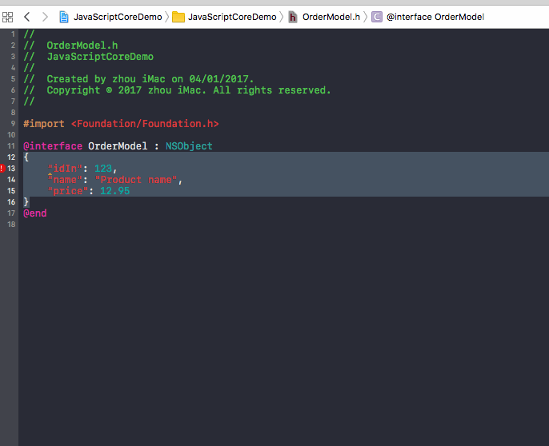

# ToPropertiesExtension
a Xcode Source Editor Extension for generator properties with json 

# require
1. macOS version 10.12.x;
2. xcode 8;
3. selected text must a valid json and a dictionary,it's a simple extension,not support nest object so far;

# install
1. Drag PropertyGenerator.app to your Applications folder
2. Run PropertyGenerator.app and exit.
3. Go to System Preferences -> Extensions -> Xcode Source Editor and enable the extension
4. The menu-item should now be available from Xcode's Editor menu.

